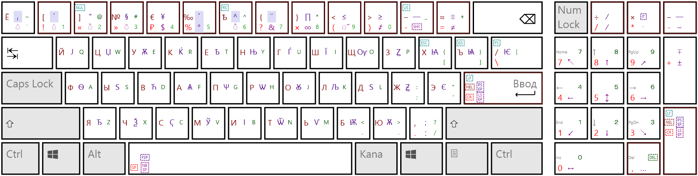
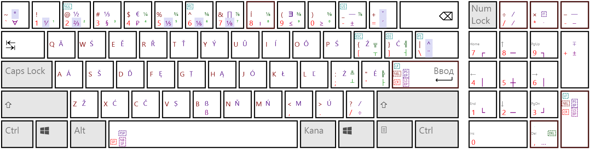

# Разкладки клавіатуры для Windows

Двѣ разкладки (версія 3.1), собранныя изъ исходниковъ на C (безъ MSKLC):

| dll | Названіе | Языкъ | KLID |
|---|---|---|---|
| `KbdSlav.dll` | А́збука | ru-RU | `a0000419` |
| `KbdLat.dll`  | Latinská | en-US | `a0000409` |

Правый Alt въ обѣихъ разкладкахъ — не Ctrl+Alt, а отдѣльный модификаторъ (AltGr, внутри — Kana).
Поэтому сочетанія съ правымъ Alt не перехватываются программами какъ «горячія клавиши».

## Установка

1. Скачать изъ [релизовъ](../../releases) архивъ нужной разкладки и своей архитектуры: `KbdSlav-amd64.zip`, `KbdLat-arm64.zip` и т. п.
   Архивы нѣсколькихъ разкладокъ можно распаковать въ одну папку.
2. Распаковать и запустить `Kbd.cmd` — безъ параметровъ онъ покажетъ разкладки и команды:

```bat
Kbd -Install KbdSlav
Kbd -Install KbdSlav,KbdLat
Kbd -Update
Kbd -Uninstall KbdSlav
```

Скриптъ самъ попроситъ права администратора, положитъ dll въ `System32` и `SysWOW64`, запишетъ разкладку
въ реестръ и добавитъ её къ языку текущаго пользователя (`-NoLangBar` — не добавлять).  
Удалить можно и изъ «Установленныхъ приложеній». Подробности — въ шапкѣ [Install-Kbd.ps1](Install-Kbd.ps1).

### Или MSI

`KbdSlav.msi` и `KbdLat.msi` изъ тѣхъ же релизовъ — по пакету на разкладку, каждый годится и для x64,
и для ARM64 (Windows 11). Онъ дѣлаетъ то же, что скриптъ, только средствами Windows Installer, и прежнюю
установку скриптомъ замѣняетъ. Безъ окна и безъ добавленія въ списокъ языковъ:

```bat
msiexec /i KbdSlav.msi /qn NOLANGBAR=1
```

Сборка: `dotnet build Setup\KbdSlav.wixproj -c Release` (нужны dll всѣхъ трёхъ платформъ),
подробности — въ [Setup](Setup).

## Общее для обѣихъ разкладокъ

| Клавиша | | Shift | Ctrl | AltGr | AltGr+Shift |
|---|---|---|---|---|---|
| Enter | CR | NEL | LF | LS (U+2028) | PS (U+2029) |
| Пробѣлъ | пробѣлъ | пробѣлъ | пробѣлъ | неразрывный | узкій неразрывный (U+202F) |
| Num / | / | ÷ | | ∕ | ⁄ |
| Num * | * | × | | ⋅ | невидимое умноженіе |
| Num − | - | − | | – | — |
| Num + | + | + | | ± | ∓ |
| Num , | , | | . | … | ‥ |

Ctrl+Pause даётъ ETX, Ctrl+Backspace — DEL. Римскія цифры Ⅰ…Ⅹ — на Ctrl+цифрахъ цифрового блока.

## А́збука (KbdSlav)



Основа — ЙЦУКЕН. **CapsLock переключаетъ буквы и цифры на латинскую QWERTY**,
такъ что латиница доступна безъ смѣны разкладки.

Верхній рядъ (обычно / Shift / AltGr / AltGr+Shift; † — мёртвая клавиша):

| Клавиша | | Shift | AltGr | AltGr+Shift |
|---|---|---|---|---|
| `` ` `` | ё | Ё | ◌̀ | † ᵢ (подстрочные) |
| 1 | ! | [ | ◌́ | † ´ |
| 2 | « | ] | ◌̏ | " |
| 3 | » | № | ◌̄ | § |
| 4 | ₽ | € | $ | ¥ |
| 5 | % | ‰ | † ° (кружокъ, надстрочные) | † ˇ |
| 6 | ѣ | Ѣ | ◌̂ | † ^ |
| 7 | ? | { | & | † ¨ |
| 8 | × | } | ∞ | ∏ |
| 9 | ( | < | ◌҃ (титло) | ≤ |
| 0 | ) | > | ҂ | ≥ |
| - | - | − | мягкій переносъ | — |
| = | = | ≈ | ≠ | ≡ |
| `/` (у праваго Shift) | . | , | : | ; |

Буквы съ AltGr (Shift — прописная):

| | | | | | | | | | | | | |
|---|---|---|---|---|---|---|---|---|---|---|---|---|
| й→ј | ц→џ | у→ѫ | к→ќ | е→ѣ | н→њ | г→ѓ | ш→ї | щ→ѹ | з→ꙁ | х→ꙗ | ъ→ѩ | \\→ѥ |
| ф→ѳ | ы→ѕ | в→ћ | а→ѧ | п→ѱ | р→ѡ | о→ꙋ | л→љ | д→ѕ | ж→ꙃ | э→є | | |
| я→ђ | ч→ѯ | с→ҁ | м→ў | и→і | т→ѿ | ь→ѵ | б→ѭ | ю→ѫ | | | | |

Мёртвыя клавиши (буквы для нихъ — латинскія, въ режимѣ CapsLock):

- **°** — кружокъ: ° + a, u, w, y → å ů ẘ ẙ (и прописныя); остальныя буквы, цифры, `+ - = ( )` → надстрочные:
  ¹ ² ⁿ ᵇ ᴮ ꟲ …, а также н→ᵸ, ъ→ꚜ, ь→ꚝ, ә→ᵊ;
- **ᵢ** — подстрочные: ₀…₉ ₊ ₋ ₌ ₍ ₎ ₐ ₑ ₕ ᵢ ⱼ ₖ ₗ ₘ ₙ ₒ ₚ ᵣ ₛ ₜ ᵤ ᵥ ₓ ₔ;
- **´ ˇ ^ ¨** — á ć é ǵ í ĺ ń ó ŕ ś ú ý ź; ǎ č ď ě ǧ ȟ ǐ ǰ ǩ ľ ň ř š ť ǒ ǔ ž ǯ dž; â ê î ô û; ä ë ï ö ü ÿ.

AltGr + цифры цифрового блока — стрѣлки ↖ ↑ ↗ ← ↕ → ↙ ↓ ↘ и ↔ на 0.

## Latinská (KbdLat)



Основа — американская QWERTY. AltGr (Shift — прописная):

| | | | | | | | | | | | |
|---|---|---|---|---|---|---|---|---|---|---|---|
| q→ä | w→ś | e→ě | r→ř | t→ť | y→ý | u→ů | i→í | o→ô | p→ś | [→ź | ]→ć |
| a→á | s→š | d→ď | f→ę | g→ț | h→ą | j→ó | k→ł | l→ľ | ;→ż | '→é | |
| z→ž | x→ć | c→č | v→ș | b→ß/ẞ | n→ň | m→ń | ,→μ | .→ú | /→÷ | | |

Верхній рядъ съ AltGr: `` ` ``→∀, 3→§, 4→₽ (Shift €), 8→ı (Shift İ), 9→≤ (Shift ∃), 0→≥, -→± (Shift —);
мёртвыя: `` AltGr+Shift+` `` °, `=` ´ (Shift ˇ), `\` ¨ (Shift ^), `<>`-клавиша ˝ (Shift),
дроби: 1 ⅟, 2 ⅔, 5 ⅕, 6 ⅙, 7 ⅛ — напримѣръ, ⅟ затѣмъ 2 → ½, ⅙ затѣмъ 5 → ⅚.

CapsLock на цифрахъ даётъ надстрочные ¹²³⁴…⁰, CapsLock+Shift — дроби ½ ⅓ ¼ ¾ ⅚ ⅞ ⅛ ⅜ ⅝;
на `[ ] ; '` — линіи ┬ ┤ ┴ ├ (Shift — двойныя).

## Сборка

```bat
MSBuild KbdSlav\KbdSlav.vcxproj /p:Configuration=Release /p:Platform=x64
```

Платформы: `x64`, `ARM64`, `Win32`. Win32 собирается съ `BUILD_WOW6432` и годна только для `SysWOW64`.  
Конфигурація `MSKLC` собираетъ исходники, порождённые Microsoft Keyboard Layout Creator изъ `.klc`.  
При каждомъ пушѣ въ `master` GitHub Actions собираетъ всѣ dll и выкладываетъ архивы въ релизъ.

Исходники разкладокъ — [KbdSlav/MyKbdSlav.cpp](KbdSlav/MyKbdSlav.cpp) и [KbdLat/MyKbdLat.cpp](KbdLat/MyKbdLat.cpp).  
`DeCompile` — вспомогательная программа, выводящая таблицы готовой dll въ видѣ исходника на C.  
`KbdImage` — WinForms приложеніе, строящее картинку разкладки по MyKbd*.cpp или по .dll.
